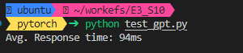
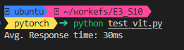
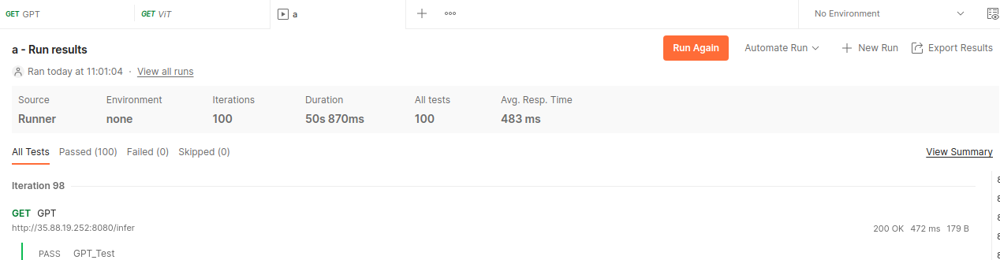
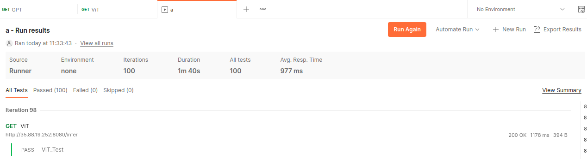

<div align="center">

# Session 10

</div>


## Introduction

In this session, we will deploy a model using the FastAPI framework. 


## Notes

The docker image has been pushed to the Docker Hub repository.


## Testing Locally

You can start the app locally via

```
uvicorn server_vit:app --host 0.0.0.0 --port 8080 --reload
uvicorn server_gpt:app --host 0.0.0.0 --port 8080 --reload
```
## Building the Image

```
docker build -t emlos10:gpt -f Dockerfile_gpt .
docker build -t emlos10:vit -f Dockerfile_vit .
```

Then, you can run the apps via
```
docker run -it --rm -p 8080:8080 emlos10:gpt
docker run -it --rm -p 8080:8080 emlos10:vit
```

## Measuring the Response Time

We can time the response in a simple Python script, where the average duration is calculated.





We can also calculate the average response time in Postman via API Testing. Note that unlike the Python script method which ran directly on the EC2 instance, this method was performed from the desktop app and hence the response time is higher. This method also includes test that can check the response's body contents.



